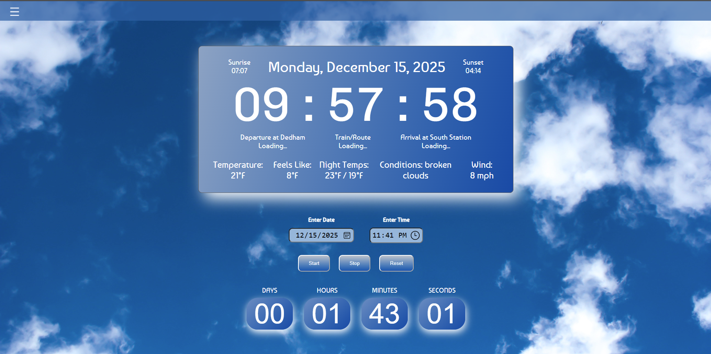
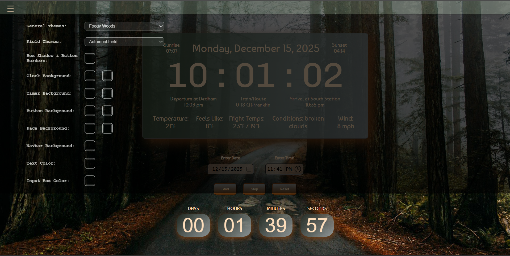

# WebClock Dashboard

**WebClock** is a customizable, feature-rich digital dashboard designed to run in any modern web browser. It aggregates essential daily information—live clock, weather conditions, astronomical sun data, and MBTA commuter rail schedules—configured for **Dedham, MA**.

It features an advanced theming engine with preset visual styles, dynamic background imagery, interactive color pickers with automatic synchronization, persistent preferences, a dynamic multi-timer system, and a full-featured **Theme Studio**.

## 📸 Screenshots

### Main Dashboard


_The main view showing the clock, weather, sun times, and train schedule._

### Theme Customization


_The customization menu allowing for theme selection and manual color adjustments._

---

## ✨ Features

### 🕒 Time & Date & Focus Mode
- **Digital Clock:** Large, easy-to-read 12-hour display (HH:MM:SS) using the _Chivo Mono_ font, framed by a 1px theme-colored inner accent border with dedicated spacing above and below.
- **Calendar & Astro Data:** Displays current Day of the week, Month, Date, Year, and real-time **Sunrise** / **Sunset** times for Dedham, MA (via `sunrisesunset.io`).
- **Focus Mode (Collapsible Clock):** Click the collapse button (`▼` / `▶`) in the top-right corner of the clock to collapse it into a distraction-free **Focus Mode** showing only the live time digits. In Focus Mode, an active theme box-shadow glow permanently illuminates the inner accent frame.
- **Drag to Move Anywhere:** Drag the grip handle (`⠿`), top section, or digits to reposition the clock anywhere on your dashboard. Position automatically persists in `localStorage`. Double-click to reset the clock to its default centered layout.

### 🌦️ Weather Widget
- **Current Conditions:** Real-time temperature, "feels like" temp, and sky condition description with bold component labels.
- **Forecast:** Period-based high/low temperature display (Morning, Afternoon, Evening, Night).
- **Wind:** Real-time wind speed in MPH.
- _Powered by OpenWeatherMap API_.

### 🚆 MBTA Commuter Rail Tracker
- **Routes & Directions:**
  - **Inbound:** Monitors **Dedham Corporate Center** to **South Station**.
  - **Outbound:** Monitors **Dedham Corporate Center** to **Forge Park/495**.
- **Real-Time Data:** Fetches live real-time predictions; seamlessly falls back to scheduled times if live data is unavailable.
- **Streamlined Layout:** Displays next Departure Time, official Train Number with Route Name (e.g. `5768 (Franklin/Foxboro)`), and estimated Arrival Time at each respective destination inside glassmorphic, grid-aligned horizontal pill rows with dedicated direction badges and custom commuter rail icons.
- _Powered by MBTA V3 API_.

### 🎨 Theme Studio & Visual Designer
- **Full-Screen Workspace & Collapsible Accordions:** An expansive design environment featuring clean, collapsible section accordions for fast navigation across theme metadata, backgrounds, and color palettes.
- **Interactive Mock Display:** Design new themes against an isolated, non-live mock WebClock dashboard showing real-time updates for clock digits, date, sun times, transit tracker, weather widget, timer gauges, and the To-Do list.
- **Live Test Mode:** Minimize the studio into a sleek, floating bottom toolbar (`👁️ Test Live`) to test changes directly on the active WebClock dashboard. Reopen the studio with your in-progress draft preserved, copy the code directly, or keep and import with one click.
- **Local Image Browsing & Instant Preview:** Pick any image file directly from your computer (Desktop, Downloads, etc.) to preview immediately in both the mock display and live test mode. The studio suggests a clean theme name and pre-fills the project path (`images/<filename>`) for seamless export.
- **Categorized Visual Color Palette:** Logically organized into 5 intuitive color groups with dedicated color pickers and 0–100% opacity range sliders:
  - 🌐 **General & Global Colors:** Text Color and Box Shadow & Glow.
  - 🧭 **Navigation Bar:** Navbar Background (with transparency) and Navbar Text Color.
  - 🕒 **Main Clock Card:** Dual-tone Clock Background 1 & 2 gradients with opacity controls and Train Pill & Badge Shading & Opacity.
  - 📝 **To-Do List Card:** Independent Two-Tone Card Background 1 & 2 gradients and Item Shading & Opacity.
  - ⏳ **Countdown Timer Cards:** Two-tone Timer Card Backgrounds and circular Timer Gauge Visual fill ring.
- **Independent Scrollable Panes & Auto-Scroll:** Each section accordion body contains an internal scrollbar alongside a full-height scrollable controls column with automatic smooth scrolling when opening sections.
- **Cohesive Auto-Inheritance:** Button gradients, To-Do card backgrounds, and timer card backgrounds automatically inherit the theme's two-tone clock gradient for unified aesthetics, with full support for independent background and task item overrides.
- **Direct Code Generator:** Instantly copy clean JavaScript snippets with standard unquoted keys formatted for direct pasting into `themes.js`.
- **Theme Library & Management:** Browse all themes with category filters (All, General, Field, Custom), search by name, edit existing themes, clone/duplicate presets, or delete unwanted themes.

### ⏳ Dynamic Multi-Timer System
- **Simultaneous Countdowns:** Run multiple independent meeting or event timers at the same time.
- **Modern Hybrid Card Design:** Compact cards featuring an SVG circular progress ring indicating elapsed percentage alongside large countdown digits and target timestamps (e.g. *"Sprint Planning: Today, 7:51 PM"*).
- **Collapsible Timer Cards (Privacy Mode):** Timers default to expanded and feature a dedicated collapse button (`▼` / `▶`) on the header. Collapsing a timer minimizes it into a compact pill showing **only the timer title**, hiding the target date/time, progress ring, countdown digits, and notes for privacy.
- **Custom Notes & Overdue Count-Up:** Optional note attached to any timer (e.g. *"Bring updated datasheets"*); when a timer finishes, audio alarm (`alarm.mp3`) triggers and digits switch to counting **UP** until dismissed.
- **Dedicated "Stop Alarm" Button:** When a timer alarm goes off, a prominent glowing button appears in the bottom-right corner of the card allowing you to **silence the alarm sound** while keeping the count-up timer visible.
- **In-Place Editing:** Edit timer labels, notes, dates, or times directly via the **`✎` Edit** button on each card.
- **Popup Creation Modal:** Right-aligned "＋ Create Timer" navbar link opens a modal with custom label, note, date/time pickers, and quick `+15m / +30m / +45m / +1h` presets.
- **Default Right-Side Stack & Drag-to-Move:** New timers default to the right side of the main clock card (the first timer aligns with the top of the clock, and subsequent timers stack below with a clean gap, dynamically adjusting height if collapsed). You can also click and drag any timer card to freely position it anywhere on the dashboard. Double-click the header to reset it back to the right-side stack.
- **Dynamic Persistence:** Custom coordinates, collapse states, and timer data persist in `localStorage` across page reloads.

### 📝 Collapsible, Movable & Resizable Dashboard To-Do List
- **Top Navbar Launcher:** Dedicated "＋ Create To-Do" link in the top navbar (to the left of "＋ Create Timer") opens the to-do widget.
- **Symmetrical 415px Width & Left-Side Dynamic Sync:** The To-Do list matches the `415px` width of the timer cards for balanced visual symmetry across the dashboard. It dynamically syncs to the left of the main clock card (aligned with the top). Click and drag the header (with grip handle `⠿`) to place it anywhere on your screen. Double-click the header to reset to its default left-side position.
- **Multi-Line Text Wrapping:** Longer task descriptions automatically wrap across multiple lines and expand the item height dynamically without overflowing or clipping.
- **Customizable Size:** Drag the bottom-right corner resize handle to expand or shrink the widget's width and scrollable height to your preference. Dimensions are saved in `localStorage`.
- **Privacy Collapse Mode:** Collapsible header lets you minimize the list to leave only the "To-Do" header visible. The widget defaults to collapsed for privacy.
- **Interactive Checkboxes:** Click the box on the left of any item to complete it; the checkbox changes color to match the text and the task receives a clean strikethrough.
- **Dynamic Rows & Enter Shortcut:** Click the **`＋`** button on the header or press `Enter` while typing to instantly create and focus a new empty task row.
- **Item Removal:** Click the **`✕`** button on the right of any task to delete it.
- **Theme-Aware & Persistent:** Automatically syncs with all theme colors and stores tasks, position, dimensions, and visibility state in `localStorage`.

---

## 🚀 How to Use

### 1. Installation

Because this is a static web project, no server installation or build step is required.

1. Download or clone the repository.
2. Ensure you have the `alarm.mp3` file in the root directory for timer audio.
3. Open `index.html` in any modern web browser.

### 2. Navigation & Theming

1. Click the **Hamburger Menu (☰)** in the top-left corner of the navbar to open settings.
2. **Select a Preset:**
   - **General Themes:** Abstract palettes (e.g., _Lava, Thunderstorm, Under The Sea_).
   - **Field Themes:** Nature and seasonal themes (e.g., _Morning Field, Rainy Field, Autumnal Field_).
3. **Launch Theme Studio:** Click **"🎨 Open Theme Studio"** to design custom themes, browse local images, test live changes, and export clean JavaScript code.

### 3. Using the Multi-Timer System

1. Click the **"＋ Create Timer"** link on the right side of the navbar.
2. Enter a **Timer Label / Meeting Name** and optional **Note** (e.g. *"Bring updated datasheets"*).
3. Select the target Date (defaults to today) and Time, or use the **Quick Add** buttons (*+15m, +30m, +45m, +1h*).
4. Click **Start Timer**. A new modern card will appear on the dashboard shelf.
5. Click **`✎`** on any timer card to edit its details, date, or time in place.
6. When the timer finishes, it alerts you with audio and switches to count-up mode. Click **"🔔 Stop Alarm"** in the bottom-right corner to silence the sound, or click **"✕ Dismiss"** to remove the timer.

### 4. Using the To-Do List

1. Click the **"＋ Create To-Do"** link in the top navbar (to the left of "+ Create Timer").
2. The To-Do list card will appear on the left side of the dashboard.
3. Click the **`▶` / `▼`** button in the To-Do header to expand or collapse the list (defaults to collapsed for privacy).
4. Click the **`＋`** button in the header (or press `Enter` while typing a task) to create a new empty row.
5. Click the checkbox on the left to toggle completion (filled checkbox and strikethrough text).
6. Click the **`✕`** button on the right of any task to delete it.

## ⚙️ Configuration

The project is currently configured for **Dedham, MA**. To customize the location or transit line, edit the configuration constants at the top of each JavaScript file:

- **Weather Location:**
  - Open `weather.js`
  - Update `const CITY = "Dedham";` or modify the coordinates in `WEATHER_API_URL`.
- **Sun Time Coordinates:**
  - Open `sunTimes.js`
  - Update `const LATITUDE` and `const LONGITUDE`.
- **MBTA Stops & Direction:**
  - Open `nextTrain.js`
  - Update `DEDHAM_STOP_ID` (origin), `SOUTH_STATION_STOP_ID` (inbound destination), and `FORGE_PARK_STOP_ID` (outbound destination).

---

## 📂 Project Structure

```text
/
├── index.html          # Semantic HTML layout, Theme Studio modal, and timer markup
├── styles.css          # Core styling, responsive layout geometry, and CSS custom properties
├── clock.js            # Digital clock, date formatting, and dynamic Multi-Timer engine
├── todo.js             # Collapsible, draggable, and resizable To-Do list widget engine
├── themes.js           # Theme engine definitions, dropdown synchronization, and persistence
├── themeStudio.js      # Full-Screen Theme Studio visual customizer and live test controller
├── weather.js          # OpenWeatherMap API integration and weather widget rendering
├── sunTimes.js         # SunriseSunset.io API integration and astronomical formatting
├── nextTrain.js        # MBTA v3 API integration for real-time commuter rail tracking
├── alarm.mp3           # Audio sound for timer completion
└── images/             # Background images for scenic and seasonal themes
```

---

## 🔗 APIs Used

- [**MBTA V3 API**](https://www.mbta.com/developers/v3-api) - Commuter rail schedules and real-time predictions.
- [**OpenWeatherMap API**](https://openweathermap.org/api) - Current weather and temperature data.
- [**SunriseSunset.io API**](https://sunrisesunset.io/api/) - Astronomical sunrise and sunset data.

---

## © License

© 2025 Joe Paradiso.
_Personal project for educational purposes._

